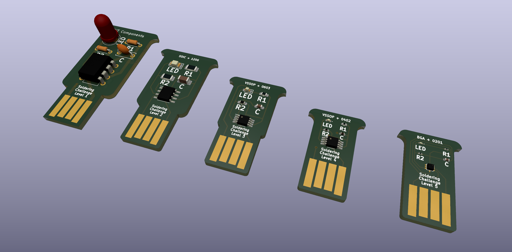
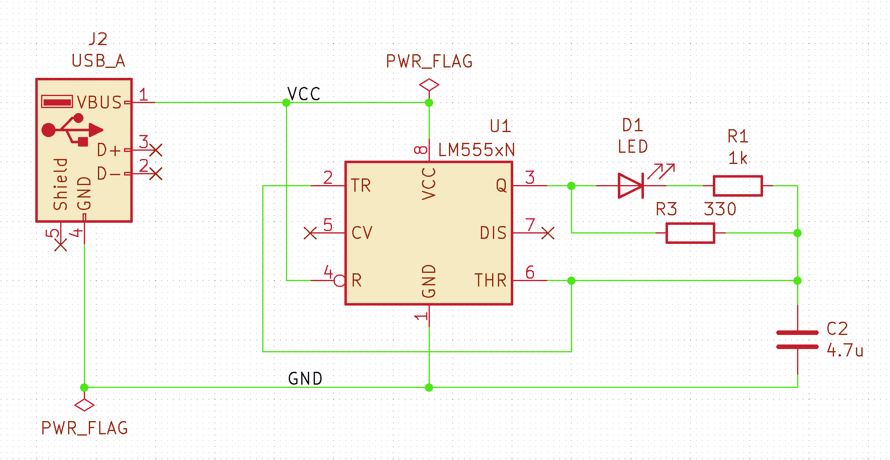

# RB0011 Pájecí výzva

Pájecí challenge je skvělý způsob jak se naučit pájet SMD součástky.

    

Pájecí výzva spočívá v zapájení všech součástek na DPS v co nejkratším čase.

## Výzva je rozdělena do pěti úrovní
- Level 1 - THT součástky
- Level 2 - SMD 1206 součástky
- Level 3 - SMD 0603 součástky
- Level 4 - SMD 0402 součástky
- Level 5 - SMD 0201 součástky

Pokud se ti podaří správně zapájet všechny součástky, tak po zapojení do USB portu začne LED blikat s frekvencí cca 2 Hz.

    

