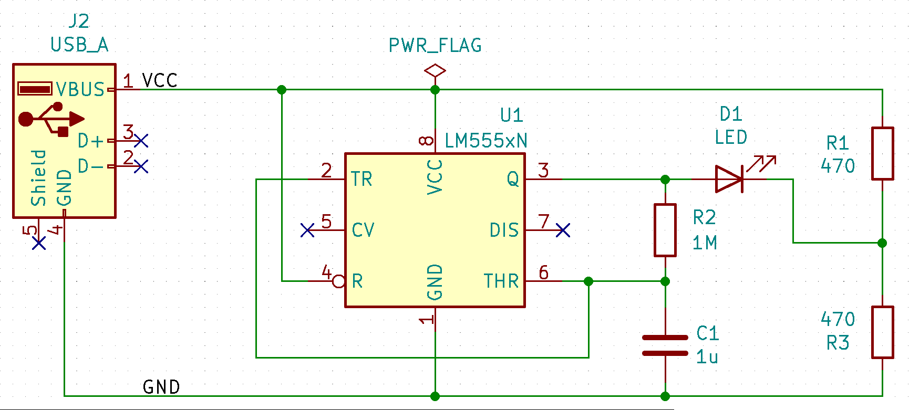

# RB0011 Soldering Challenge

Solving the SMD soldering challenge is a great way to learn how to solder SMD components.

    

The challenge is to solder all the components on the PCB in the shortest time possible.

## The challenge is divided into five levels
- Level 1 - THT components
- Level 2 - SMD 1206 components
- Level 3 - SMD 0603 components
- Level 4 - SMD 0402 components
- Level 5 - SMD 0201 components

If you manage to plug in all the components correctly, the LED will flash at about 2 Hz when plugged into the USB port.

    

